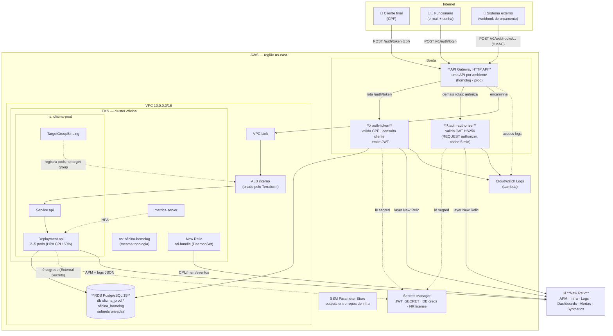
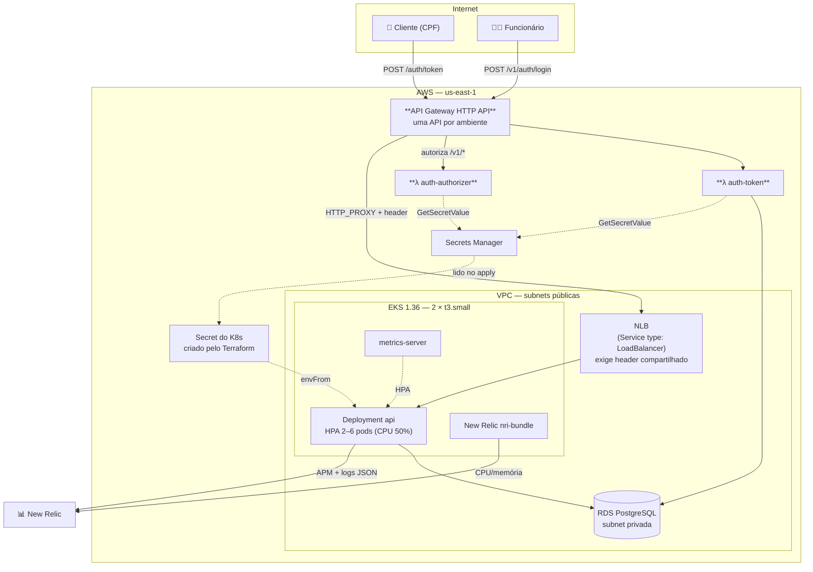
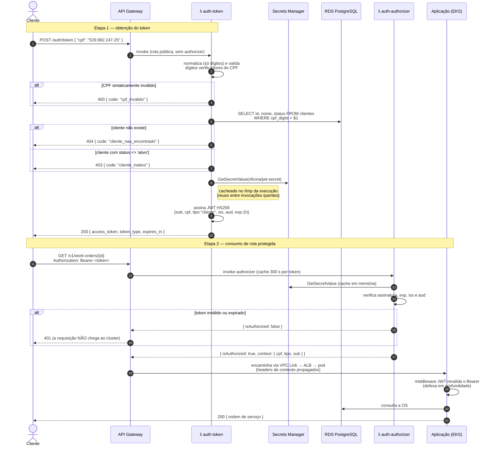
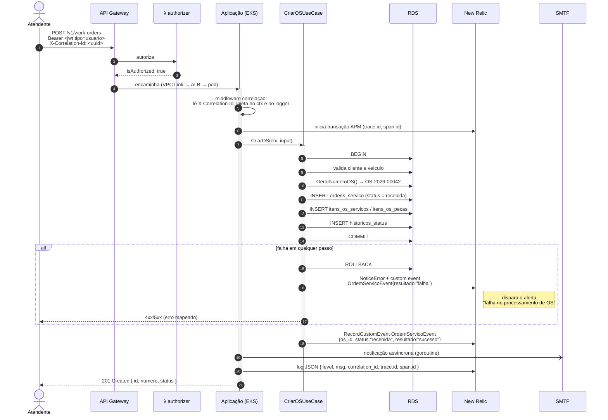
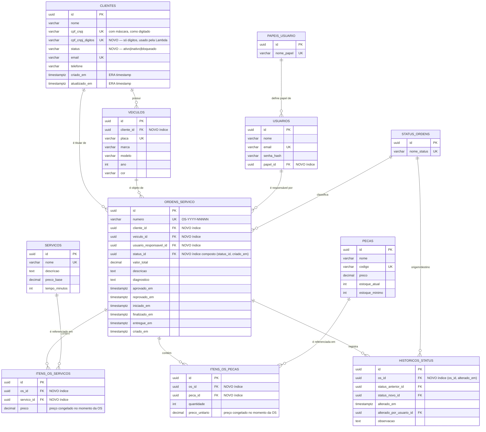
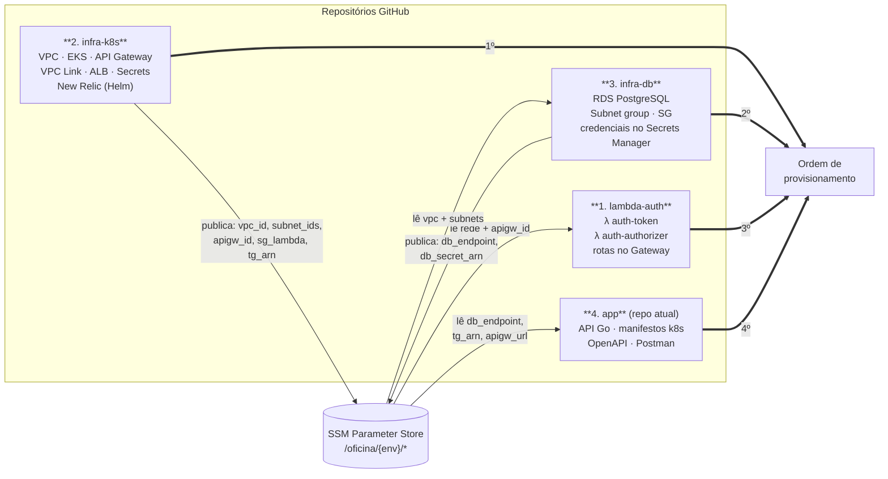
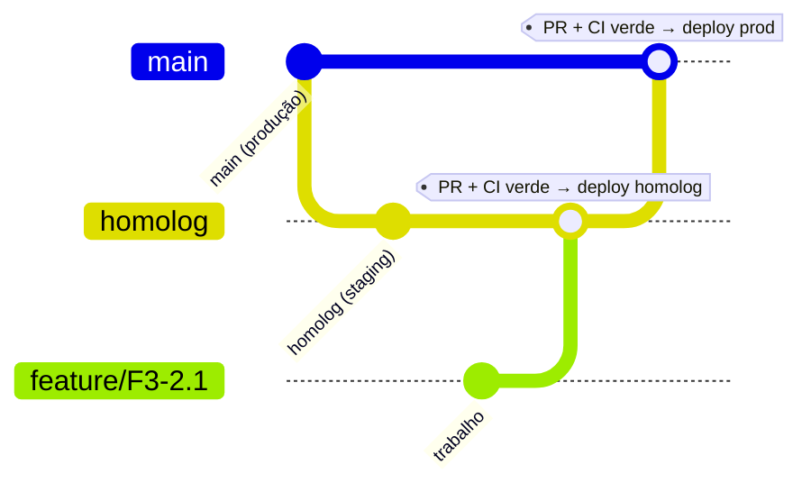

# Arquitetura-alvo — Fase 3

Documento de referência para a execução do [backlog](backlog.md). Os diagramas aqui são o **destino**; conforme os épicos forem concluídos eles migram para os READMEs dos respectivos repositórios (requisito do enunciado: "diagrama da arquitetura específica daquele repositório").

> ⏱️ A seção 1 mostra o **desenho completo**; a [seção 1.1](#11-variante-do-plano-de-10-dias-o-que-realmente-vai-ao-ar) mostra a **variante construída** — e é ela que vai para o README e para o PDF. Um diagrama com VPC Link onde existe um NLB público não é detalhe estético: é a primeira coisa que o avaliador confere contra o Terraform.

---

## 1. Diagrama de Componentes

Visão de nuvem, APIs, banco e monitoramento — como pedido no enunciado.

### 1.1 Variante do plano de 10 dias (o que realmente vai ao ar)

Cinco simplificações em relação ao diagrama acima, cada uma registrada como ADR: sem NAT Gateway, sem VPC Link, sem ALB interno/`TargetGroupBinding`, sem Cluster Autoscaler e sem External Secrets Operator.

**O que cada simplificação custa, para a ADR:**

| Simplificação | Risco assumido | Evolução |
|---|---|---|
| NLB público + header no lugar de VPC Link | o NLB é alcançável pela internet; a proteção é o header, não a rede | ALB interno + VPC Link |
| Nós em subnet pública, sem NAT | IP público nos nós; SG é a única barreira | subnets privadas + NAT |
| HPA sem Cluster Autoscaler | pods ficam `Pending` se os 2 nós lotarem | Cluster Autoscaler ou Karpenter |
| `Secret` do Terraform no lugar do ESO | rotação do segredo exige novo `apply` | External Secrets Operator |
| E-mail demonstrado local | SES não exercitado em produção | SES fora do sandbox |

---

### Responsabilidade de cada componente

| Componente | Responsabilidade | Onde é definido |
|---|---|---|
| API Gateway HTTP API | Única porta de entrada; roteamento, autorização na borda, rate limiting, access logs | repo `infra-k8s` |
| λ `auth-token` | Valida CPF (dígitos verificadores), consulta cliente no RDS, emite JWT HS256 | repo `lambda-auth` |
| λ `auth-authorizer` | Valida assinatura e expiração do JWT antes de qualquer chamada ao cluster | repo `lambda-auth` |
| VPC Link + ALB interno | Ponte privada entre o Gateway (fora da VPC) e o cluster (subnets privadas) | repo `infra-k8s` |
| EKS + HPA | Executa a aplicação com escala horizontal por CPU | repo `infra-k8s` (cluster) + repo `app` (manifestos) |
| RDS PostgreSQL | Persistência gerenciada, backup automático, subnets privadas | repo `infra-db` |
| Secrets Manager | `JWT_SECRET` (compartilhado app ↔ lambdas), credenciais do banco, license key do New Relic | `infra-db` (banco) e `infra-k8s` (demais) |
| SSM Parameter Store | Contrato entre os repos de infra (`/oficina/<env>/<chave>`) | todos os repos de infra |
| New Relic | APM, infraestrutura, logs, dashboards, alertas, synthetics | repo `app` (agente) + `infra-k8s` (Helm) |

---

## 2. Diagramas de Sequência

### 2.1 Autenticação do cliente por CPF

### 2.2 Abertura de ordem de serviço

---

## 3. Modelo Entidade-Relacionamento alvo

Em **negrito** as mudanças da Fase 3 (detalhadas em [F3-5.1](backlog.md#f3-51--revisão-do-modelo-relacional)).

### Explicação dos relacionamentos (para a RFC-002)

| Relacionamento | Cardinalidade | Por quê |
|---|---|---|
| `clientes` → `veiculos` | 1:N | Um cliente pode ter vários veículos; um veículo pertence a um único cliente (a placa é única no sistema). |
| `clientes` → `ordens_servico` | 1:N | O titular da OS é sempre o cliente. Redundante com `veiculos.cliente_id`? Não: o veículo pode ser transferido, e a OS precisa preservar **quem era o titular na abertura**. |
| `veiculos` → `ordens_servico` | 1:N | Uma OS é sempre sobre um veículo; o veículo acumula histórico de OS. |
| `usuarios` → `ordens_servico` | 1:N (opcional) | `usuario_responsavel_id` é nullable: a OS pode ser aberta antes de haver mecânico designado. |
| `status_ordens` → `ordens_servico` | 1:N | Status como **tabela de domínio** e não `ENUM`: permite adicionar status sem `ALTER TYPE`, e dá FK real ao histórico. |
| `ordens_servico` → `itens_os_servicos` / `itens_os_pecas` | 1:N | Tabelas associativas com atributo próprio (`quantidade`, `preco`) — por isso não são N:N puras. **O preço é copiado, não referenciado**: alterar o preço de uma peça no catálogo não pode alterar retroativamente o valor de OS já fechadas. |
| `ordens_servico` → `historicos_status` | 1:N | Trilha de auditoria imutável de cada transição — é a fonte do cálculo de "tempo médio por status" no dashboard. |
| `papeis_usuario` → `usuarios` | 1:N | Autorização por papel (administrador, mecânico, atendente). |

---

## 4. Topologia dos 4 repositórios e fluxo de dependências

> **Por que o `infra-k8s` vem primeiro e não o `infra-db`?** Porque a VPC vive nele. O RDS precisa das subnets privadas e do security group dos nós do EKS para restringir o acesso à porta 5432. Alternativa considerada e descartada: um quinto repo só de rede — o enunciado fixa quatro.

### Estratégia de branches (idêntica nos 4 repos)

| Branch | Protegida | Deploy automático | Ambiente |
|---|---|---|---|
| `feature/*` | não | não (só CI) | — |
| `homolog` | sim (PR obrigatório) | sim | namespace `oficina-homolog`, API Gateway `oficina-homolog` |
| `main` | sim (PR obrigatório, sem push direto) | sim, com *environment approval* | namespace `oficina-prod`, API Gateway `oficina-prod` |

> ⏱️ Com o ambiente de homologação dispensado, a tabela vira:
>
> | Branch | Protegida | Deploy automático | Ambiente |
> |---|---|---|---|
> | `feature/*` | não | não (só CI) | — |
> | `homolog` | sim (PR obrigatório) | **não** — apenas CI (build, testes, lint) | — |
> | `main` | sim (PR obrigatório, sem push direto) | sim, com *environment approval* | namespace `oficina-prod`, API Gateway `oficina-prod` |
>
> O fluxo `feature → homolog → main` com PR e CI bloqueante continua sendo demonstrado; o que deixa de existir é a infraestrutura de homologação, não o processo.
