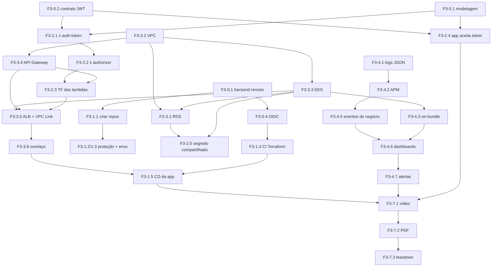

# Roadmap — Tech Challenge Fase 3

Sequência de execução, dependências, riscos e controle de custo. As tarefas referenciam os IDs de [backlog.md](backlog.md).

---

## Princípios de sequenciamento

0. **Pedidos com prazo de terceiros no dia 1.** Quota de vCPU da AWS e saída do sandbox do SES levam de horas a dois dias e não dependem de você (F3-0.5).
1. **Contratos antes de código.** O backend do Terraform, o contrato do JWT e o contrato SSM (E0) definem como quatro repositórios independentes se encaixam. Errar aqui custa retrabalho em todos eles.
2. **Rede → cluster → banco → funções → aplicação.** Cada camada publica na SSM o que a seguinte consome. Inverter a ordem trava o `apply`.
3. **Uma coisa por vez na nuvem.** Não suba EKS, RDS, Gateway e Lambda no mesmo dia esperando que funcione. Valide cada peça isoladamente (`kubectl get nodes`, `psql` de um pod, `curl` no Gateway) antes de conectar a próxima.
4. **Observabilidade cedo, não no fim.** Instrumentar depois de tudo pronto significa descobrir na última semana que os eventos de negócio exigem mudanças nos use cases. F3-4.1 e F3-4.5 podem começar já na Sprint 1 — não dependem de nuvem.
5. **Documentação em paralelo.** RFCs e ADRs se escrevem **enquanto** a decisão é tomada, com o contexto fresco. Escrever tudo na última semana produz texto genérico, e isso aparece.
6. **A nuvem só fica ligada quando alguém está trabalhando nela.** Ver [orçamento](#orçamento-e-janelas-de-provisionamento).

---

## Sprints sugeridas

### Sprint 0 — Contratos (2–3 dias)
Objetivo: destravar o trabalho paralelo dos quatro repositórios.

- **F3-0.5 — Contas, quota de vCPU e ferramentas** ← *faça no dia 1: tem prazo de terceiros*
- F3-0.1 — Backend remoto (S3 + DynamoDB) e limpeza dos `.tfstate` versionados
- F3-0.4 — OIDC GitHub ↔ AWS
- F3-0.2 — Contrato do JWT
- F3-0.3 — Convenções de tags e contrato SSM
- F3-1.1 — Criar os 4 repositórios e migrar o conteúdo
- F3-1.2 / F3-1.3 — Branch protection e environments
- F3-1.7 — Suíte de segurança nos 4 repos (**inclui a varredura histórica de segredos — faça antes de tornar os repos públicos**)

**Saída:** quatro repositórios existentes, `main` protegida, CI autenticando na AWS sem segredo de longa duração e sem segredo vazado no histórico. Aumento de quota e saída do sandbox do SES **solicitados** (a aprovação chega durante a Sprint 1).

> ⚠️ Nesta sprint nada é provisionado além do bucket e do OIDC. **Custo ≈ US$ 0.**

---

### Sprint 1 — Aplicação e banco (4–5 dias) · *não depende de nuvem*
Objetivo: deixar a aplicação pronta para a arquitetura nova, ainda rodando local.

- F3-5.1 — Migration de modelagem (índices, `status`, `cpf_cnpj_digitos`, `timestamptz`)
- F3-4.1 — Logs JSON + correlação
- F3-2.5 — Segredo obrigatório (remover o fallback inseguro)
- F3-2.4 — Claims novos, validação de `aud`, autorização por `tipo`
- F3-4.2 — Agente New Relic (funciona com a app local apontando para a conta free)
- F3-4.5 — Eventos de negócio
- F3-5.3 — Seeds de demonstração (cliente ativo e inativo com CPF válido) e remoção das senhas conhecidas

**Saída:** `docker compose up` sobe a aplicação com logs JSON correlacionados, emitindo eventos para o New Relic e com o modelo de dados novo. Tudo testável sem gastar um centavo.

---

### Sprint 2 — Infraestrutura AWS (5–6 dias)
Objetivo: a plataforma de pé.

- F3-3.2 — VPC e security groups → **valide:** `terraform output`, parâmetros SSM criados
- F3-3.3 — EKS e addons → **valide:** `kubectl get nodes`, `kubectl top nodes`
- F3-3.1 — RDS → **valide:** `psql` a partir de um pod efêmero
- F3-3.4 — API Gateway → **valide:** `curl $URL` responde 404 (existe, sem rotas)
- F3-3.5 — ALB, target group e VPC Link → **valide:** `describe-target-health`
- F3-3.6 — Overlays `homolog` e `prod`
- F3-1.4 — Pipeline de Terraform (plan em PR, apply em merge)
- F3-3.7 — SES: **peça a saída do sandbox nesta sprint**, a aprovação leva até 24 h

**Saída:** aplicação rodando no EKS, acessível pelo API Gateway, conectada ao RDS.

> Antes de sair desta sprint, releia a [Estratégia de ambientes](backlog.md#estratégia-de-ambientes-leia-antes-de-escrever-hcl): `infra-k8s` e `infra-db` **não** usam workspaces — os ambientes saem de `for_each`. Aplicar com workspaces aqui duplica cluster e VPC e quase dobra a fatura.

> Esta é a sprint mais arriscada. Reserve um dia inteiro de folga: EKS leva ~20 min por `apply`, e cada erro de security group custa um ciclo.

---

### Sprint 3 — Autenticação serverless (4–5 dias)
Objetivo: o fluxo por CPF ponta a ponta.

- F3-2.1 — Lambda `auth-token`
- F3-2.2 — Lambda `auth-authorizer`
- F3-2.3 — Terraform das funções e rotas
- F3-1.6 — CI/CD do repo da Lambda
- F3-1.5 — CD da aplicação apontando para o EKS
- F3-2.6 — OpenAPI e Postman atualizados

**Saída:** `POST /auth/token` com CPF devolve JWT; rota protegida rejeita sem token **no gateway**.

---

### Sprint 4 — Observabilidade na nuvem (3–4 dias)
Objetivo: fechar o requisito de monitoramento.

- F3-4.3 — `nri-bundle` no cluster
- F3-4.4 — Logs das Lambdas
- F3-4.6 — Dashboards (como código)
- F3-4.7 — Alertas + teste real de disparo
- F3-4.8 — Teste de carga (k6), validação do HPA e geração dos dados dos dashboards

**Saída:** dashboards populados, alerta disparado e recebido, HPA escalando visivelmente.

---

### Sprint 5 — Documentação e entrega (3–4 dias)
Objetivo: fechar os entregáveis.

- F3-6.1 — Diagramas revisados contra a implementação real
- F3-6.2 — RFCs · F3-6.3 — ADRs
- F3-5.2 — RFC-002 com ER e `EXPLAIN` comparativos
- F3-6.4 — Os 4 READMEs
- F3-7.1 — Vídeo · F3-7.2 — PDF e `soat-architecture`
- F3-7.3 — Teardown e verificação de recursos órfãos

**Saída:** entrega submetida, custo zerado.

---

## Grafo de dependências



### Caminho crítico

`F3-0.1 → F3-0.4 → F3-3.2 → F3-3.3 → F3-3.4 → F3-2.3 → F3-3.5 → F3-1.5 → F3-4.6 → F3-4.8 → F3-7.1 → F3-7.2`

Traduzindo: **backend remoto → OIDC → rede → cluster → gateway → lambdas → VPC Link → deploy → dashboard → carga → vídeo**. Atraso em qualquer um desses atrasa a entrega. Tudo o mais (modelagem, logs, RFCs, ADRs) é paralelizável — e por isso deve ser feito **por outra pessoa, em paralelo**, não depois.

---

## Ordem obrigatória de `terraform apply`

```
1º  bootstrap/                (uma única vez, backend local)
2º  oficina-infra-k8s         VPC + EKS + Gateway + ALB/VPC Link + Secrets
3º  oficina-infra-db          RDS (lê VPC e SG dos nós na SSM)
4º  oficina-lambda-auth       Funções + rotas + authorizer (lê Gateway e rede)
5º  oficina-infra-k8s (2ª vez) amarra o authorizer nas rotas /v1/*
6º  oficina-app               kubectl apply -k (TargetGroupBinding + Deployment)
```

O passo 5 existe porque o `authorizer_id` só nasce no passo 4. É a única costura assimétrica da arquitetura — deixe registrada no README do `infra-k8s`, porque quem provisionar do zero pela segunda vez vai tropeçar nela.

**Destroy = ordem inversa** (6 → 2). Ver [F3-7.3](backlog.md#f3-73--controle-de-custo-e-teardown).

---

## Orçamento e janelas de provisionamento

O ambiente completo custa ~**US$ 7,20/dia** (detalhamento em [F3-7.3](backlog.md#f3-73--controle-de-custo-e-teardown)). Estratégia recomendada:

> ⏱️ **Números do [plano de 10 dias](plano-10-dias.md#custo-real-da-nuvem) são outros:** com os cortes de NAT, ALB e nós menores, o custo cai para ~US$ 4,90/dia — **~US$ 44 no total**, ligando em 02/09 e destruindo após a entrega. Lá também está o motivo de **não** destruir e recriar diariamente.

| Sprint | Nuvem ligada? | Custo estimado |
|---|---|---|
| Sprint 0 | não (só S3 + OIDC) | ~US$ 0 |
| Sprint 1 | não (tudo local) | ~US$ 0 |
| Sprint 2 | sim, dias úteis | ~US$ 40 |
| Sprint 3 | sim, dias úteis | ~US$ 35 |
| Sprint 4 | sim, dias úteis | ~US$ 30 |
| Sprint 5 | apenas no dia da gravação | ~US$ 10 |
| **Total** | | **~US$ 115** |

> ⚠️ **Exceção à regra do destroy:** os dashboards de "volume diário" e "tempo médio por status" precisam de dados espalhados no tempo. Mantenha o ambiente ligado (ou pelo menos gere tráfego) nos **3–5 dias antes da gravação** — ver [F3-4.8](backlog.md#f3-48--teste-de-carga-e-validação-do-autoescalonamento). Um gráfico diário com um único ponto não demonstra nada.

Reduções possíveis, se o orçamento apertar:
- **Um ambiente só.** Reduza `local.ambientes` para `["prod"]` e demonstre o deploy por branch apenas em produção. Economiza a segunda instância RDS (~US$ 12) e o segundo Gateway. O cluster e a VPC já são compartilhados, então a economia é pequena — e o requisito de "homologação e produção" fica mais frágil. Só faça se o orçamento apertar de verdade.
- **Nós menores.** `t3.small` em vez de `t3.medium` reduz ~US$ 30/mês, mas aperta o HPA — teste a demonstração de carga antes de decidir.
- **Sem NAT.** VPC Endpoints em vez de NAT Gateway economiza ~US$ 10/mês líquidos e dá mais trabalho. Só compensa se o ambiente ficar ligado semanas.
- **Fargate para o EKS.** Elimina o custo dos nós ociosos, mas não suporta DaemonSet — e o agente do New Relic é DaemonSet. **Não use.**

---

## Riscos e mitigações

| Risco | Prob. | Impacto | Mitigação |
|---|---|---|---|
| VPC Link + ALB + target group não fecham (503 no Gateway) | Alta | Alto | Validar cada salto isoladamente; conferir as 4 regras de SG de F3-3.5; plano B do ALB internet-facing com header secreto |
| `terraform destroy` trava por recurso órfão (ENI de Lambda, ALB do Ingress) | Alta | Médio | Checklist de recursos órfãos em F3-7.3; nunca criar ALB por Ingress **e** por Terraform ao mesmo tempo |
| Custo AWS estourar sem ninguém perceber | Média | Alto | AWS Budgets **no primeiro dia** com alerta em 50% previsto; destroy ao fim de cada sprint |
| Free tier do New Relic estourar (100 GB/mês) | Média | Médio | `LOG_LEVEL=info` em prod; Pixie desligado; acompanhar *Data management* |
| Cold start da Lambda em VPC degradar o login na demo | Média | Baixo | Aquecer com uma chamada antes de gravar; considerar `provisioned_concurrency = 1` só no dia (custa centavos) |
| Coordenar 4 repositórios atrasar tudo | Média | Alto | Contrato SSM fechado na Sprint 0; ordem de apply documentada; uma pessoa dona de cada repo |
| Lambda esgotar conexões do RDS sob carga | Baixa | Médio | `SetMaxOpenConns(1)`; documentar RDS Proxy como evolução na RFC-003 |
| Cache do authorizer (300 s) mascarar teste de token expirado | Média | Baixo | Testar com token de validade curta ou reduzir o TTL temporariamente |
| `main` protegida bloquear time de uma pessoa só | Alta | Baixo | `required_approving_review_count: 0`, mantendo os status checks obrigatórios |
| Aplicar `infra-k8s` com workspaces por engano, duplicando cluster e VPC | Média | Alto | Sem `terraform workspace` nesses repos; o step de workspace no workflow é guardado por `vars.USA_WORKSPACES`; conferir `terraform workspace show` = `default` antes do apply |
| Quota de vCPU de conta nova (5 vCPUs) impedir o 3º nó — HPA cria pods `Pending` e a demo de escala morre | Alta | Alto | Pedir aumento para 32 vCPUs na **Sprint 0** (F3-0.5); conferir a aprovação antes da Sprint 2 |
| Time sem acesso `kubectl` ao cluster (só a role do CI é admin) | Alta | Alto | `access_entries` por pessoa em F3-3.3; validar com `kubectl get nodes` da máquina de cada um |
| Primeiro `apply` falhar por provider `kubernetes`/`helm` depender do cluster inexistente | Alta | Médio | `terraform apply -target=module.eks` primeiro; documentado em F3-3.3 |
| SES em sandbox impedir o envio de e-mail na gravação | Alta | Médio | Verificar os endereços de destino **e** pedir saída do sandbox na Sprint 0/2 (aprovação leva até 24 h) |
| Dashboards vazios no dia da gravação | Alta | Alto | Gerar tráfego e OS nos 3–5 dias anteriores (F3-4.8); não deixar para o dia |
| Diagramas divergirem da implementação final | Alta | Médio | F3-6.1 explicitamente **depois** de E3; revisão contra o `terraform state list` |
| Vídeo estourar 15 min | Alta | Alto | Roteiro cronometrado em [entrega.md](entrega.md); gravar por blocos; ambiente pré-aquecido |

---

## Divisão sugerida por integrante

| Pessoa | Épicos | Repositórios |
|---|---|---|
| **A — Backend/domínio** | E5 (modelagem), F3-2.4, F3-2.5, F3-4.1, F3-4.2, F3-4.5 | `oficina-app` |
| **B — Cloud/Infra** | E0, E3, F3-4.3, F3-7.3 | `oficina-infra-k8s`, `oficina-infra-db` |
| **C — Serverless + CI/CD** | E1 (pipelines), F3-1.7, F3-2.1 → F3-2.3, F3-1.6, F3-4.4, F3-4.8 | `oficina-lambda-auth` |
| **Todos** | E6 (cada um documenta as próprias decisões), E7 | — |

**Pontos de sincronização obrigatórios:**
- Fim da Sprint 0 — contrato SSM e contrato do JWT fechados e escritos.
- Meio da Sprint 2 — B entrega VPC e cluster; C começa o Terraform das Lambdas.
- Fim da Sprint 3 — A, B e C validam o fluxo ponta a ponta juntos, com o Postman.
- Sprint 5 — ensaio do vídeo completo antes da gravação final.
