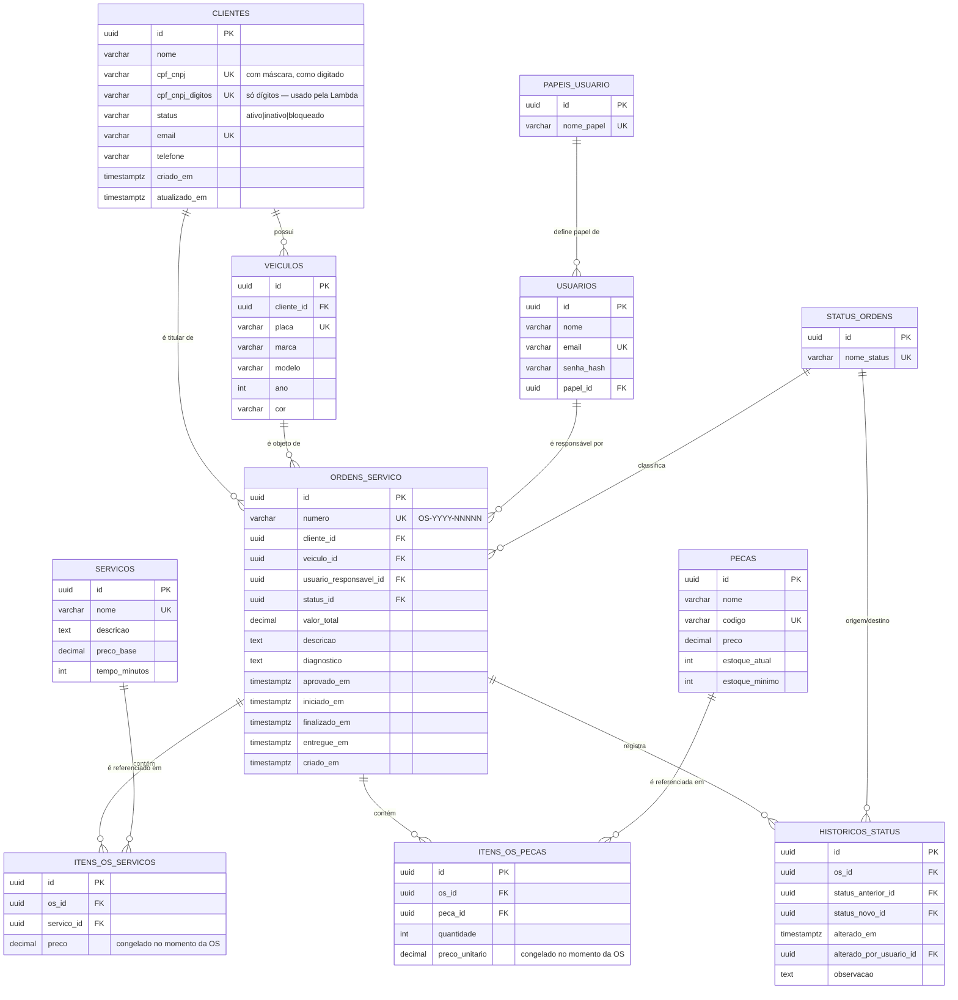

# RFC-002 — Banco de dados gerenciado e modelo relacional

| Campo | Valor |
|---|---|
| **Status** | Aceita |
| **Autores** | Equipe SOAT — Tech Challenge Fase 3 |
| **Relacionadas** | [RFC-001](RFC-001-escolha-da-nuvem.md), [RFC-003](RFC-003-autenticacao.md); ADR-001 (banco: PostgreSQL) |

## Contexto

O enunciado pede um **banco de dados gerenciado** e exige "melhorar e documentar a
modelagem, garantindo consistência **e performance**". A revisão do estado herdado
da Fase 2 revelou:

- o banco **não tinha um único índice secundário** — nem as foreign keys estavam
  indexadas (no PostgreSQL, FKs **não** ganham índice automático), o que provocava
  *sequential scan* em toda listagem de OS e em todo `JOIN`;
- **não existia `status` no cliente**, mas a Lambda de autenticação precisa
  consultar a existência **e o status** do cliente;
- `cpf_cnpj` era `varchar(20)` **sem normalização** — cadastro com máscara
  (`529.982.247-25`) e consulta por dígitos (`52998224725`) falhariam silenciosamente;
- todos os timestamps eram `timestamp` **sem timezone**, deslocando o dashboard de
  "volume diário de OS" em 3 h.

## Decisão

### 1. SGBD: PostgreSQL 15 gerenciado no Amazon RDS

Instância `aws_db_instance` PostgreSQL 15, storage `gp3` criptografado, em subnets
**privadas**, com Security Group liberando a porta 5432 apenas para os SGs do EKS e
das Lambdas. Credenciais no **Secrets Manager** (nunca em GitHub Secrets); endpoint
e ARN do segredo publicados no **SSM Parameter Store** para os demais repositórios.

### 2. Modelagem relacional (mudanças da Fase 3)

Aplicadas na migration `000005_fase3_modelagem`:

- coluna **`status`** em `clientes` (`varchar(20)`, `CHECK IN ('ativo','inativo','bloqueado')`);
- coluna gerada **`cpf_cnpj_digitos`** (só dígitos) com índice único `ux_clientes_cpf_digitos` — é a coluna que a Lambda consulta;
- **índices em todas as foreign keys** (`ix_veiculos_cliente`, `ix_os_cliente`, `ix_os_veiculo`, `ix_os_status`, `ix_historicos_os`, `ix_itens_os_*`…);
- migração dos timestamps para **`timestamptz`**.

## Modelo Entidade-Relacionamento

### Explicação dos relacionamentos

| Relacionamento | Cardinalidade | Por quê |
|---|---|---|
| `clientes` → `veiculos` | 1:N | Um cliente pode ter vários veículos; a placa é única no sistema. |
| `clientes` → `ordens_servico` | 1:N | O titular da OS é sempre o cliente. Não é redundante com `veiculos.cliente_id`: o veículo pode ser transferido, e a OS precisa preservar **quem era o titular na abertura**. |
| `veiculos` → `ordens_servico` | 1:N | Uma OS é sempre sobre um veículo, que acumula histórico de OS. |
| `usuarios` → `ordens_servico` | 1:N (opcional) | `usuario_responsavel_id` é *nullable*: a OS pode ser aberta antes de haver mecânico designado. |
| `status_ordens` → `ordens_servico` | 1:N | Status como **tabela de domínio** (não `ENUM`): permite adicionar status sem `ALTER TYPE` e dá FK real ao histórico. |
| `ordens_servico` → `itens_os_*` | 1:N | Tabelas associativas com atributo próprio (`quantidade`, `preco`) — por isso não são N:N puras. **O preço é copiado, não referenciado**: alterar o catálogo não pode mudar retroativamente o valor de OS já fechadas. |
| `ordens_servico` → `historicos_status` | 1:N | Trilha de auditoria imutável de cada transição — fonte do cálculo de "tempo médio por status" no dashboard. |
| `papeis_usuario` → `usuarios` | 1:N | Autorização por papel (administrador, mecânico, atendente). |

## Alternativas consideradas

| Alternativa | Prós | Contras | Veredito |
|---|---|---|---|
| **PostgreSQL 15 (RDS)** | ACID completo, FKs, `DECIMAL` preciso, colunas geradas, `timestamptz`, maturidade | Control plane e storage têm custo | **Escolhida** |
| MySQL / MariaDB (RDS/Aurora) | Popular, boa leitura | `DECIMAL` e enforcement de FK menos consistentes por engine; sem coluna gerada equivalente tão direta | Descartada |
| DynamoDB (NoSQL gerenciado) | Escala horizontal, serverless | Domínio é fortemente relacional (OS ↔ itens ↔ histórico ↔ estoque); sem JOIN nem transação multi-tabela natural | Descartada |
| SQLite / banco local | Zero infra | Enunciado exige banco **gerenciado**; sem concorrência real | Descartada |

## Justificativa (consistência e performance)

1. **Transações ACID são críticas.** Dois fluxos exigem atomicidade multi-tabela: dedução de estoque ao avançar a OS e o par "transição em `ordens_servico` + `INSERT` em `historicos_status`". Sem transação, o estoque ou a trilha ficariam inconsistentes.
2. **Integridade referencial via FKs** em todas as relações do modelo.
3. **Performance por indexação deliberada.** Indexar as FKs elimina o *sequential scan* nas listagens de OS e nos JOINs; o índice `(status_id, criado_em)` serve diretamente ao dashboard "tempo médio por status"; e `ux_clientes_cpf_digitos` torna a consulta da Lambda um *index scan* de custo constante.
4. **Correção de fuso.** `timestamptz` garante que "volume diário de OS" no dashboard (America/Sao_Paulo) não saia deslocado em relação ao armazenamento em UTC.

## Consequências

- **Positivas:** modelo consistente, auditável e com consultas indexadas para os relatórios de negócio.
- **Riscos assumidos:** a Lambda pode esgotar conexões do RDS sob carga → mitigado com `SetMaxOpenConns(1)`; **RDS Proxy** fica registrado como evolução (ver [RFC-003](RFC-003-autenticacao.md)). Seeds de demonstração não podem levar senhas conhecidas a produção → tratado na migration de seeds. O CPF **nunca** é logado (LGPD).

## Referências

- Migrations: `internal/infra/database/migrations/000005_fase3_modelagem.up.sql`, `000006` (seeds)
- Planejamento: [`backlog.md` — F3-5.1 revisão do modelo relacional](../planejamentos/fase-3/backlog.md), [`arquitetura.md` — Modelo ER alvo](../planejamentos/fase-3/arquitetura.md)
- Decisão pontual: [ADR-001 — Banco de dados: PostgreSQL](../architecture-decisions.md)
