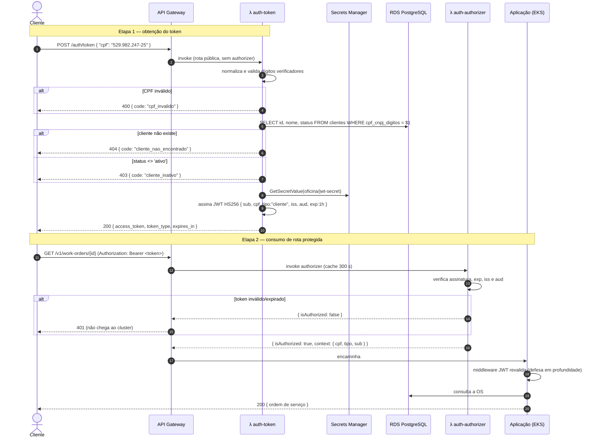

# RFC-003 — Estratégia de autenticação: CPF serverless, API Gateway e JWT

| Campo | Valor |
|---|---|
| **Status** | Aceita |
| **Autores** | Equipe SOAT — Tech Challenge Fase 3 |
| **Relacionadas** | [RFC-001](RFC-001-escolha-da-nuvem.md), [RFC-002](RFC-002-banco-de-dados.md); ADR-010 (cliente × usuário) |

## Contexto

O enunciado exige um **API Gateway** como porta de entrada e uma **função
serverless** que autentique o **cliente final por CPF**: validar o CPF, consultar
a **existência e o status** do cliente na base e emitir um **JWT**. Rotas
sensíveis só podem ser consumidas com esse token, validado **antes** de chegar ao
cluster.

Restrições herdadas:

- a aplicação Go já valida **JWT HS256** (`internal/infra/http/middleware/jwt.go`);
- já existe o login de **funcionário** por e-mail + senha (`POST /v1/auth/login`) —
  os dois fluxos precisam coexistir sem se confundir.

## Decisão

### 1. Duas Lambdas em Go, atrás do API Gateway HTTP API (v2)

- **`auth-token`** (rota pública `POST /auth/token`): normaliza o CPF (só dígitos),
  valida os dígitos verificadores, consulta `clientes` por `cpf_cnpj_digitos`,
  verifica o `status` e emite o JWT.
- **`auth-authorizer`** (Lambda Authorizer REQUEST, cache 5 min): valida assinatura,
  expiração, `iss` e `aud` do JWT **na borda**, antes de qualquer chamada ao cluster.

### 2. Assinatura HS256 com segredo compartilhado no Secrets Manager

O mesmo `JWT_SECRET` é lido pela Lambda e pela aplicação a partir do Secrets
Manager. Isso reaproveita o middleware HS256 já existente e evita reescrevê-lo.

> **Por que Lambda Authorizer e não o JWT Authorizer nativo?** O JWT Authorizer do
> API Gateway exige um emissor OIDC com **JWKS público** — incompatível com HS256
> (segredo simétrico). O authorizer customizado (REQUEST) é a forma correta de
> validar HS256 na borda.

### 3. Contrato do JWT (dois tipos de sujeito)

O claim **`tipo`** discrimina o escopo: `cliente` (fluxo por CPF) ou `usuario`
(funcionário). A aplicação autoriza rotas com base nele.

**Token de cliente** (emitido por `auth-token`):

```json
{
  "sub":  "<uuid do cliente>",
  "cpf":  "<somente dígitos>",
  "nome": "<nome do cliente>",
  "tipo": "cliente",
  "iss":  "oficina-auth-lambda",
  "aud":  "oficina-api",
  "iat":  1690000000,
  "exp":  1690003600
}
```
`exp` = **1 hora**.

**Token de usuário/funcionário** (emitido por `POST /v1/auth/login` na aplicação):

```json
{
  "sub":   "<uuid do usuário>",
  "email": "<e-mail>",
  "nome":  "<nome>",
  "papel": "<administrador|mecanico|atendente>",
  "tipo":  "usuario",
  "iss":   "oficina-api",
  "aud":   "oficina-api",
  "iat":   1690000000,
  "exp":   1690028800
}
```
`exp` = **8 horas**.

Ambos usam `aud = oficina-api`; a aplicação valida `aud` e `tipo` além da
assinatura.

### 4. Defesa em profundidade

Mesmo após o authorizer aprovar na borda, o **middleware JWT da aplicação
revalida** o Bearer. Se o gateway for contornado (ex.: acesso direto ao NLB), a
aplicação continua exigindo token válido.

## Fluxo (autenticação do cliente por CPF)



## Alternativas consideradas

| Alternativa | Prós | Contras | Veredito |
|---|---|---|---|
| **Lambda Authorizer REQUEST + HS256** | Reaproveita o middleware existente; valida na borda; simples | Segredo simétrico compartilhado; rotação exige propagar o segredo | **Escolhida** |
| JWT Authorizer nativo (RS256 + JWKS) | Sem segredo compartilhado; rotação por chave | Exige emissor OIDC/JWKS público; reescrever emissão e middleware | Descartada (evolução) |
| Cognito User Pools | Gerenciado, MFA, fluxos prontos | Autenticação por **CPF** (não e-mail/senha) não é o caso de uso nativo; sobrecarga para o escopo | Descartada |
| Sessão/cookie no gateway | Simples | Não atende JWT stateless entre serverless e cluster | Descartada |

## Consequências

- **Positivas:** token stateless validado na borda; rejeição de requisição sem token **antes** do cluster; um único middleware HS256 em toda a stack.
- **Riscos assumidos:**
  - **Segredo simétrico** — quem tiver o `JWT_SECRET` forja tokens. Mitigado mantendo-o só no Secrets Manager e nunca versionado; evolução para **RS256/JWKS** registrada como caminho futuro.
  - **Cache do authorizer (300 s)** pode mascarar teste de token expirado — mitigado testando com token de validade curta.
  - **Cold start** da Lambda em VPC pode degradar o login na demo — mitigado aquecendo antes de gravar.
  - **Conexões do RDS** pela Lambda sob carga → `SetMaxOpenConns(1)`; **RDS Proxy** fica documentado como evolução (pooling gerenciado que sobrevive ao ciclo efêmero da Lambda).
  - O **CPF nunca é logado** (LGPD); segue apenas dentro do token e do contexto da requisição.

## Referências

- Contrato do JWT: [`backlog.md` — F3-0.2](../planejamentos/fase-3/backlog.md)
- Diagramas: [`arquitetura.md` — Sequência de autenticação](../planejamentos/fase-3/arquitetura.md)
- Código: repo `oficina-lambda-auth` (`cmd/auth-token`, `cmd/auth-authorizer`, `internal/{cpf,token,segredo}`); `internal/infra/http/middleware/jwt.go` (aplicação)
- Decisão pontual: ADR-010 (coexistência cliente × usuário) em [`architecture-decisions.md`](../architecture-decisions.md)
