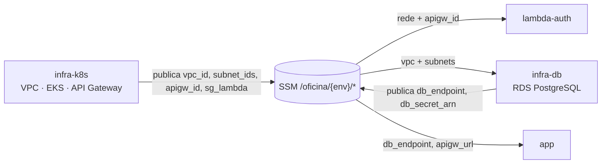

# RFC-004 — Estratégia de ambientes e CI/CD

| Campo | Valor |
|---|---|
| **Status** | Aceita |
| **Autores** | Equipe SOAT — Tech Challenge Fase 3 |
| **Relacionadas** | [RFC-001](RFC-001-escolha-da-nuvem.md), [RFC-002](RFC-002-banco-de-dados.md) |

## Contexto

A Fase 3 divide o sistema em **4 repositórios** independentes — `oficina-app`,
`oficina-lambda-auth`, `oficina-infra-k8s`, `oficina-infra-db` — cada um com seu
CI/CD, `main` protegida, PR obrigatório e deploy automático. O enunciado pede
deploy de **homologação e produção**.

Três decisões precisam ser tomadas juntas: **quantos ambientes** provisionar, **como
os ambientes são modelados no Terraform** e **como os 4 repositórios se comunicam**
sem se acoplarem ao state um do outro.

## Decisão

### 1. Ambiente único de produção (homologação dispensada)

Por orientação registrada no fórum da disciplina, **apenas `prod`** é provisionado.
A branch `homolog` mantém CI (build, testes, lint) **sem deploy**. O fluxo
`feature → homolog → main` com PR e CI bloqueante continua sendo demonstrado; o que
deixa de existir é a **infraestrutura** de homologação, não o processo.

> ⚠️ Como o enunciado pede deploy das duas branches, o print da orientação do fórum
> deve ser guardado e citado nos 4 READMEs — sem a evidência, a divergência conta
> contra na avaliação.

### 2. Ambientes por `for_each`, não por workspace

Os ambientes saem de `for_each` sobre `local.ambientes`. Com a dispensa,
`local.ambientes = toset(["prod"])` — o `for_each` permanece, com um elemento. Se os
dois ambientes voltassem, bastaria uma linha; VPC, cluster e balanceador
continuariam **compartilhados** (recursos por ambiente saem do `for_each`).

**Nenhum repositório de infra usa `terraform workspace`.** Workspace serve para
separar ambientes; com um ambiente só, ele vira apenas uma forma nova de aplicar no
lugar errado — e aplicar `infra-k8s` com workspaces por engano duplicaria cluster e
VPC, quase dobrando a fatura. O workspace ativo é sempre `default`.

### 3. SSM Parameter Store como contrato entre repos

Cada repositório publica seus outputs como parâmetros `/oficina/<env>/<chave>` e lê
os dos outros **por nome** — sem `terraform_remote_state`, sem acesso ao state
alheio nem permissão no bucket do outro time.

**Ordem de provisionamento:** `infra-k8s` (a VPC vive nele) → `infra-db` → `lambda-auth`
→ `infra-k8s` (2ª passada, amarra o authorizer nas rotas `/v1/*`) → `app`. Destroy na
ordem inversa.

### 4. Pipeline de Terraform: plan em PR, apply em merge, OIDC com duas roles

- **PR** → `terraform plan` com uma role IAM **read-only** (OIDC);
- **merge em `main`** → `terraform apply` com uma role de **escrita** (OIDC), sob
  *environment approval* do GitHub;
- actions **fixadas por commit SHA**; **gitleaks** em todos os repos;
- `main` protegida por *ruleset*: PR obrigatório, sem push direto nem force-push.
  `required_approving_review_count` fica em nível compatível com um time pequeno,
  mantendo os status checks obrigatórios.

## Alternativas consideradas

| Tema | Alternativa | Contras | Veredito |
|---|---|---|---|
| Nº de ambientes | Homolog + prod completos | +US$ 73/mês de control plane duplicado; orçamento acadêmico | Dispensado homolog |
| Modelagem | `terraform workspace` por ambiente | Alto risco de aplicar no lugar errado; duplica infra compartilhada | `for_each` |
| Comunicação | `terraform_remote_state` | Acopla ao state e ao bucket do outro repo; quebra o isolamento dos times | SSM Parameter Store |
| Segredo de CI | `AWS_SECRET_ACCESS_KEY` em GitHub Secrets | Segredo de longa duração versionável e vazável | OIDC (sem segredo) |

## Consequências

- **Positivas:** 4 repositórios com CI/CD independente e acoplamento fraco; deploy sem segredo de longa duração; reversível para dois ambientes em uma linha.
- **Riscos assumidos:** a costura assimétrica da 2ª passada do `infra-k8s` (o `authorizer_id` só nasce depois das Lambdas) precisa ficar documentada no README do `infra-k8s`; a divergência "só prod" precisa da evidência do fórum; o *environment approval* de prod exige um revisor configurado.

## Referências

- [`README.md` — Decisões técnicas](../planejamentos/fase-3/README.md), [`backlog.md` — Estratégia de ambientes / F3-0.1 / F3-1.4](../planejamentos/fase-3/backlog.md)
- [`roadmap.md` — Ordem obrigatória de `terraform apply`](../planejamentos/fase-3/roadmap.md)
- [`arquitetura.md` — Topologia dos 4 repositórios](../planejamentos/fase-3/arquitetura.md)
